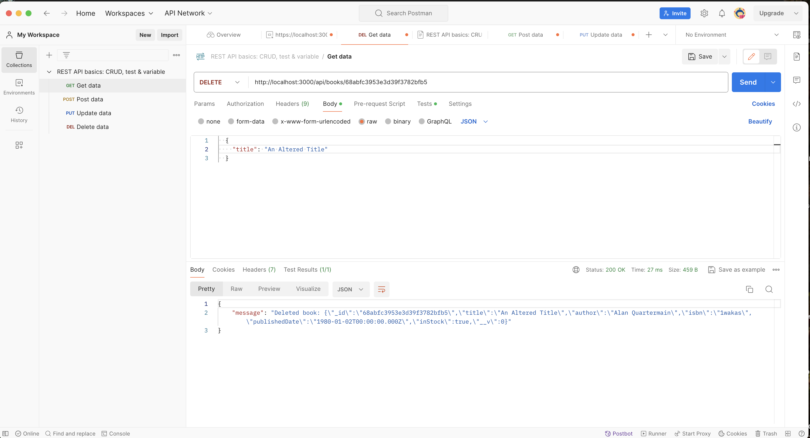

## Reflection Questions

1.  Why is it beneficial to separate your routes, models, and database connection into different directories?

Separation of concerns, and so you don't get this gigantic block of code to wade through to debug when something goes wrong.

Helps with maintainability too, in that someone reading a file reads short functional code that uses well-named references to other files.  So, readers can understand what happens, but don't have to wade through big blocks of code to do it.  If looking for details, the individual file can be referenced.

2.  What is the difference between PUT and PATCH HTTP methods, and which one does your PUT /:id endpoint more closely resemble?

PUT completely replaces, PATCH partially replaces.  If I make a PUT /:id, then it's going to be a PUT, not a PATCH.  Since I used PUT, it's PUT - though under the hood, I think Mongoose treats it like a PATCH, as the entire entry doesn't need to be provided, only changed fields.

3.  In the DELETE route, what is a good practice for the response you send back to the client after a successful deletion? Should you send the deleted object, a simple success message, or something else? Why?

Return the deleted item for confirmation purposes.  'Congratulations, deletion successful!' is the sort of message that just makes users break out in a cold sweat.  Who knows what they deleted?  Their hopes, their dreams, their entire database?

An informative response like 'You have successfully deleted 'Unused Boots' from inventory' is much better.

I'd actually say best practice is not to use DELETE at all.  Rather, use PATCH to toggle information to 'toBeDeleted' or such, along with a date.  Then user can 'undo' DELETE.  Periodically 'toBeDeleted' entries above a certain age could be deleted.

## SCREENSHOTS

Postman screenshots of functionality.

Postman Create Book

Postman Get All Books

Postman Get Book By ID

Postman Update Book By ID

Postman Delete Book By ID

Book List (After Deletion By ID)

Postman Update Book Error Handling (Error handling is performed similarly for all operations.)

## SETUP

In Bash active directory,

npm init -y
npm install dotenv express mongoose

## NOTES

https://mongoosejs.com/docs/connections.html

For local MongoDB databases, we recommend using 127.0.0.1 instead of localhost. That is because Node.js 18 and up prefer IPv6 addresses, which means, on many machines, Node.js will resolve localhost to the IPv6 address ::1 and Mongoose will be unable to connect, unless the mongodb instance is running with ipv6 enabled.

Postman requires 'raw' with JSON to pass req.body (not req.book), with double quotes for strings including keys.

  {
    "title": "All Things Great And Small",
    "author": "Alan Quartermain",
    "isbn": "1wakas",
    "publishedDate": "1980-01-02",
    "inStock": true
  }

  Postman also requires a res to be sent; simply sending a console.log does not 'resolve', so the connection hangs.